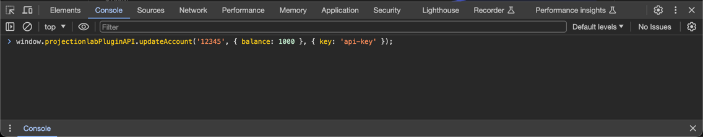

## Import your Monarch Money account data into ProjectionLab
Updates your [ProjectionLab](https://projectionlab.com/) account balances with the latest data from [Monarch Money](https://monarch.com).

### How it Works
1. **Connects to APIs**: Scripts communicate with both Monarch Money and ProjectionLab's Plugin API.
2. **Fetches Monarch Data**: Your Monarch Money account balances are directly downloaded to your machine.
3. **Updates ProjectionLab**: The project updates your ProjectionLab account information using the `updateAccount()` [Plugin API](https://app.projectionlab.com/docs/module-PluginAPI.html#.updateAccount).

Here is how the API looks like:
```javascript
window.projectionlabPluginAPI.updateAccount('12345', { balance: 1000 }, { key: 'YOUR_PL_API_KEY' })
```
In the above example, `12345` is the `accountId` of your account in ProjectionLab, `1000` is the new balance and `YOUR_PL_API_KEY` is the Plugin API key (see below on how to get the key).
If you have 10 accounts, you have to call this API 10 times, with the correct `accountId` and balance, to update of all the accounts. And since the API uses the `window` object, 
you should call this API from the browser's developer console. 

See the image below:



When you run the script (in step 5 below), it generates a string that you can copy and paste into the browser's developer console. Your account data is downloaded directly from Monarch Money 
to your local machine and then the script will update the account balances in ProjectionLab.

### Getting Started

#### Prerequisites:
- Your Monarch Money account credentials
- Basic familiarity with your browser's developer console

### Step-by-Step Guide
#### Step 0: Backup your current data in ProjectionLab
Since this will modify ProjectionLab's application data, it's better to do a backup (Account Settings > Export Data), so you have something to restore from if needed.

#### Step 1: Set up ProjectionLab to use the plugin API
1. Login to [ProjectionLab](https://projectionlab.com) and go to Account Settings on the top right.
2. Open Plugins page -> (Account Settings > Plugins)
3. Enable the switch '**Enable Plugins**'.
4. Copy the value in the text box '**Plugin API Key**'. (From now on, this key will be referred to as `YOUR_PL_API_KEY`.)

#### Step 2: Get the `accountId` of ProjectionLab accounts that you want to import
ℹ️ You need to do this step only once ℹ️

The goal of this step is to get the `accountId` of the accounts in ProjectionLab that you want to update. To help you do that, this step lists all accounts in ProjectionLab with their `accountId` and `name`.

1. Open the Developer Console of your browser and run the following script that gives you the `id` and `name` of the accounts. 

‼️Remember to replace `YOUR_PL_API_KEY` with the key that you copied in step 1.4 above ‼️ 
```javascript
const exportData = await window.projectionlabPluginAPI.exportData({ key: 'YOUR_PL_API_KEY' });

// Merge the list of savings accounts, investment accounts, assets and debts
const plAccounts = [...exportData.today.savingsAccounts, ...exportData.today.investmentAccounts,
                    ...exportData.today.assets, ...exportData.today.debts];

plAccounts.forEach(account => {
    console.log(account.id, account.name)
});
```
2. The browser console will display the id and name of your accounts in ProjectionLab.
3. Copy the list of `account.id` and `account.name` of those accounts.

#### Step 3: Get the corresponding `accountId` from Monarch Money
ℹ️ **You need to do this step only once** ℹ️ 
1. Open the file 'config.js' and replace `monarch_email` and `monarch_password` with your Monarch credentials.
   * If you have configured Multi-Factor Authentication, you will need to update `monarch_mfa` with the mfa code.
   * Note - this is not the recovery code, but the 30+ character code that is shown right next to the QR code when you set up MFA.
   * You might have to re-enable MFA if you don't have the code with you.
2. Open terminal and install the node packages by running `npm install`.
3. Run `node get-monarch-accounts.js` in the terminal.
4. The terminal will display the list of Monarch accounts with their `id` and `name`. 
5. Copy the list of the `id`s of the accounts you want to import.

#### Step 4: Update the mapping of Monarch ID and ProjectionLabs accountId `config.js` file
ℹ️️ **You need to do this step only once** ℹ️️ 
1. Open the file 'config.js'
2. Replace `YOUR_PL_API_KEY` with the key that you copied in step 1.4 above.
3. Update the `accountMapping` array with the corresponding `id`s of Monarch accounts and ProjectLab accounts - Monarch id in `monarchAccountID` and ProjectionLabs id in `plAccountID`.

#### Step 5: Get the script to import data into ProjectionLab
1. Run `node index.js` to get the script that you can use in ProjectionLab.
2. Copy the script from the terminal output
3. Open browser's developer console of the ProjectionLab browser and paste the above script and hit Enter

The accounts in the ProjectionLab will be updated with the new values. Congratulations! You did it! Each time you want to update the account balances in ProjectionLab, you only need to run step 5.

### Contributing
Contributions are welcome!