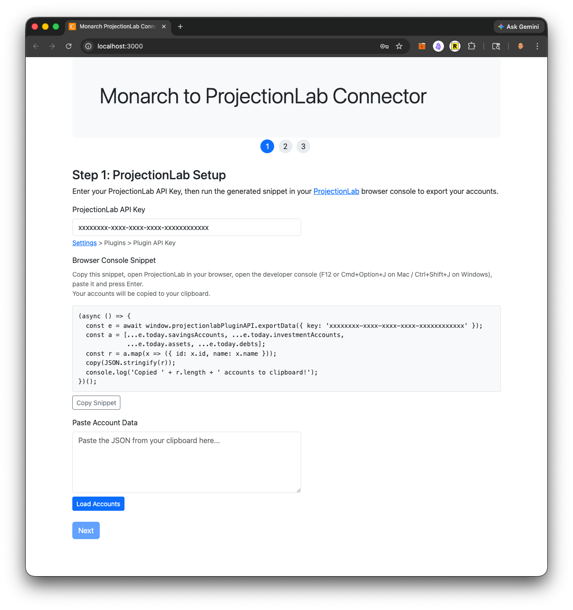
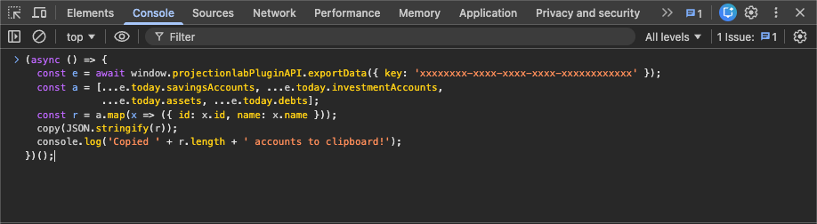
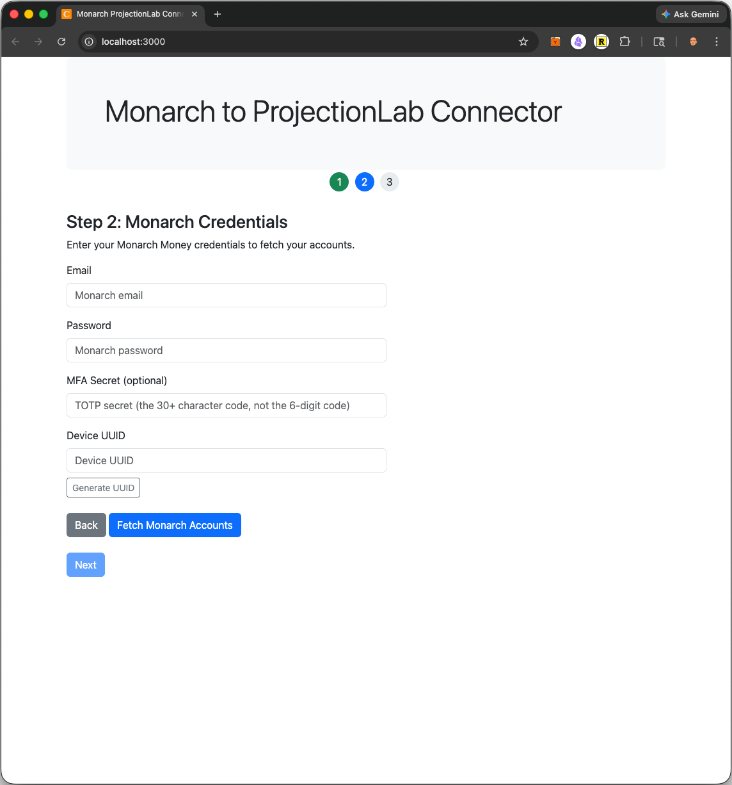
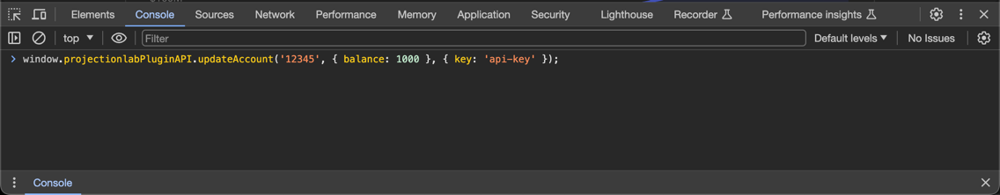
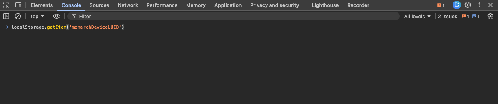

## Import your Monarch Money account data into ProjectionLab
Updates your [ProjectionLab](https://projectionlab.com/) account balances with the latest data from [Monarch Money](https://monarch.com).

### Important Notes
- This project uses Monarch's private app endpoints. Monarch does **not** offer an official public API for this workflow, so login support is best effort and may break without warning.
- Login is more reliable when you enable MFA in Monarch and configure this project to use your MFA secret key.

> [!NOTE]
> **What is the MFA secret key?**
> 
> When you enable MFA in Monarch (**Settings -> Security -> Multi-Factor Authentication**), you'll see a **"Two-factor text code"** — a long string of letters and numbers (30+ characters). This is the secret key you need.

> [!IMPORTANT]
> **Common mistake:** Do **not** enter the 6-digit code from your authenticator app. That code changes every 30 seconds and will not work. You need the permanent secret key shown during MFA setup.

### How it Works
1. **Connects to APIs**: Scripts communicate with both Monarch Money and ProjectionLab's Plugin API.
2. **Fetches Monarch Data**: Your Monarch Money account balances are downloaded directly to your machine.
3. **Updates ProjectionLab**: The project updates your ProjectionLab account information using the `updateAccount()` [Plugin API](https://app.projectionlab.com/docs/module-PluginAPI.html#.updateAccount).

There are two ways to set up this project:
- **Web UI** (recommended) — a guided setup wizard that walks you through configuration and account mapping. **If you're unsure which to pick, use this option — you can skip the CLI section entirely.**
- **CLI** — configure everything manually from the terminal

### Getting Started

#### Prerequisites
- [Node.js](https://nodejs.org/) installed (no coding experience needed — the Web UI will guide you)
- Your Monarch Money account credentials
- Recommended: enable MFA in Monarch before setup
- Your ProjectionLab Plugin API key

#### Installation

To download the latest version, click the green **Code** button on the [GitHub page](https://github.com/georgeck/projectionlab-monarchmoney-import) and select **Download ZIP**. 
Unzip the folder, then open a terminal in that folder and run:

```bash
npm install
cp config.example.js config.js
```

---

### Option A: Web UI (Recommended)

The web UI is the easiest option and is recommended for most users. It walks you through setup in 3 steps.

```bash
npm start
```

Open http://localhost:3000 in your browser. The wizard will walk you through:



#### Step 1: ProjectionLab Setup
1. Enter your ProjectionLab Plugin API key ([Settings](https://app.projectionlab.com/settings) > Plugins > Plugin API Key); you need to `Enable Plugins` first.
2. Copy the generated browser console snippet.
3. Open [ProjectionLab](https://app.projectionlab.com) in your browser.
4. Open the developer console: press **F12** (or **Cmd+Option+J** on Mac / **Ctrl+Shift+J** on Windows).
5. Paste the snippet into the console and press Enter. This is safe — it only reads your account names and IDs.
6. Your accounts will be copied to your clipboard.
7. Go back to the setup wizard, paste the result into the text area, and click **Load Accounts**.



#### Step 2: Monarch Credentials
1. Enter your Monarch Money email and password.
2. Recommended: enable MFA in Monarch first.
3. In Monarch, go to **Settings -> Security -> Multi-Factor Authentication** and copy the **Two-factor text code** (the long secret key, not the 6-digit code).
4. Paste that value into the MFA field.
5. **Device UUID** is optional. If left blank, one will be generated automatically. If you have trouble logging in, see **How to Find Your Device UUID** below.
6. Click **Fetch Monarch Accounts** to verify your credentials and retrieve your accounts.

If login fails without MFA configured, enable MFA in Monarch and try again using the secret key above.



#### Step 3: Account Mapping
1. For each Monarch account, select the corresponding ProjectionLab account from the dropdown (or select "— Skip —" to exclude it).
2. Click **Save Configuration** to write your `config.js` file.

---

## Syncing Balances (Daily Usage)

Once configured, sync your balances anytime.

#### Option 1: Web UI (easiest)

1. Start the web UI if it isn't already running: `npm start`
2. Open http://localhost:3000 — if setup is already complete, it will skip straight to **Step 4: Sync Balances**.
3. Click **Sync Now** — the app fetches your latest Monarch balances automatically.
4. Click **Copy to Clipboard**.
5. Open [ProjectionLab](https://app.projectionlab.com), press **F12** (or **Cmd+Option+J** on Mac / **Ctrl+Shift+J** on Windows), paste, and press Enter.

> If you need to change your credentials or account mapping, click **Reconfigure Setup** at the bottom of Step 4.

#### Option 2: Terminal

```bash
npm run get-latest
```

Copy the output, open ProjectionLab's developer console, paste it, and press Enter.



Each time you want to update balances, just repeat either option above.

---

### Option B: CLI Setup

If you prefer to configure everything manually without the web UI:

#### Step 0: Backup your current data in ProjectionLab
Since this will modify ProjectionLab's application data, back up first (Account Settings > Export Data).

#### Step 1: Set up ProjectionLab to use the Plugin API
1. Login to [ProjectionLab](https://projectionlab.com) and go to Account Settings.
2. Open Plugins page (Settings > Plugins).
3. Enable the switch **Enable Plugins**.
4. Copy the **Plugin API Key**.

#### Step 2: Configure your credentials
1. Copy `config.example.js` to `config.js` (if you haven't already).
2. Open `config.js` and fill in your Monarch credentials (`monarch_email`, `monarch_password`).
3. Recommended: enable MFA in Monarch before continuing.
4. In Monarch, go to **Settings -> Security -> Enable MFA** and copy the **Two-factor text code**.
5. Set `monarch_mfa` to that secret key. Do **not** use the 6-digit code from your authenticator app.
6. Set `device_uuid` if you have one (see **How to Find Your Device UUID** below). If left blank, one will be generated automatically.
7. Set `projection_Labs_api_key` to the Plugin API key from step 1.

#### Step 3: Get your ProjectionLab account IDs
Open the ProjectionLab developer console and run:
```javascript
const exportData = await window.projectionlabPluginAPI.exportData({ key: 'YOUR_PL_API_KEY' });
const plAccounts = [...exportData.today.savingsAccounts, ...exportData.today.investmentAccounts,
                    ...exportData.today.assets, ...exportData.today.debts];
plAccounts.forEach(account => console.log(account.id, account.name));
```

#### Step 4: Get your Monarch Money account IDs
```bash
npm run getMonarchAccounts
```

#### Step 5: Update the account mapping in `config.js`
Add entries to the `accountMapping` array pairing each Monarch account ID with its ProjectionLab account ID:
```javascript
let accountMapping = [
    {
        plAccountID: "xxxxxxxx-xxxx-xxxx-xxxx-xxxxxxxxxxxx",
        monarchAccountID: "123456789012345678",
        plDisplayName: "My Account Name"
    },
];
```

#### Step 6: Sync balances
Follow the steps in **Syncing Balances** above.

---

### Security
- `config.js` contains your credentials and is **gitignored** — it will never be committed.
- `config.example.js` is the committed template with placeholder values.
- If you use the web UI, a backup (`config.js.backup`) is created before each save.

### How to Find Your Device UUID

The Device UUID is optional — if you leave it blank, one will be generated automatically. However, if you have trouble logging in, using Monarch's existing device UUID from your browser may help.

1. Log in to [Monarch Money](https://app.monarchmoney.com).
2. Right-click the page and choose **Inspect**.
3. In the developer tools panel, open the **Console** tab.
4. Type `localStorage.getItem('monarchDeviceUUID')` and press Enter.
5. Copy the value that is returned and use it as your `device_uuid`.



Notes:
- In some browsers, pasting into the console may be blocked for security reasons. If that happens, type the command manually.
- If no value is returned, you can generate a new UUID in this project's web UI.

### Troubleshooting Monarch Login
- **"Please update to the latest version"** — This error means Monarch changed their login requirements. Update to the latest version of this project (`git pull && npm install`) or download the latest release from GitHub.
- **Login fails without MFA** — Enable MFA in Monarch and configure `monarch_mfa` using the **Two-factor text code** (the long secret key) from **Settings -> Security -> Enable MFA**.
- **Wrong MFA value** — Do not paste the temporary 6-digit code from your authenticator app. This project needs the permanent secret key (30+ characters shown when you first set up MFA).
- **Device UUID issues** — If login still fails, try retrieving your device UUID from Monarch (see above) or generating a new one in the web UI.
- **Intermittent failures** — Because this project relies on an unofficial Monarch integration, authentication can stop working temporarily after Monarch changes their app. Check the [issues page](https://github.com/georgeck/projectionlab-monarchmoney-import/issues) for updates.

### Contributing
Contributions are welcome!
